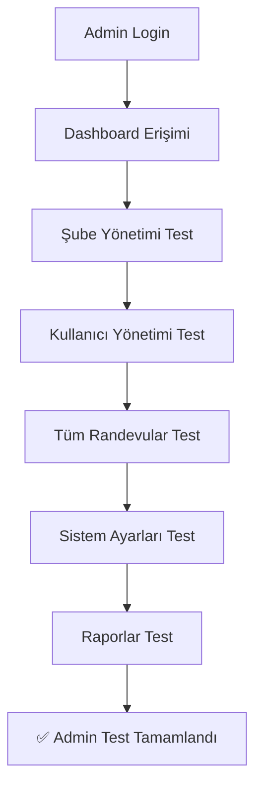
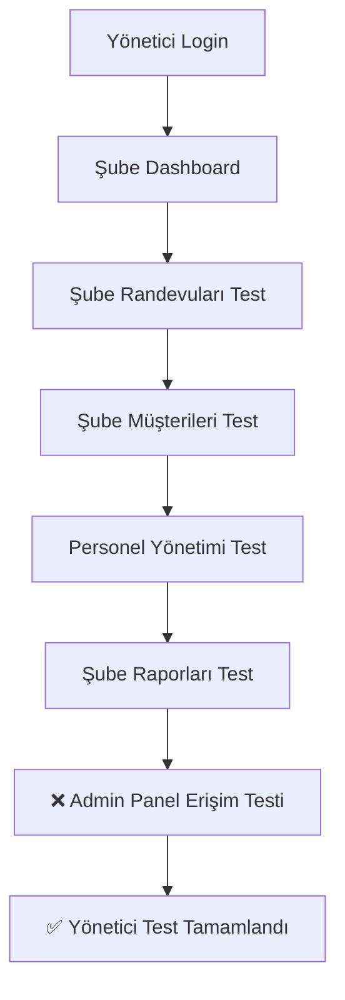
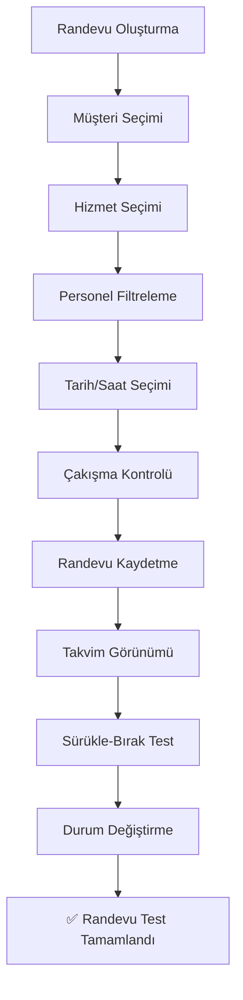
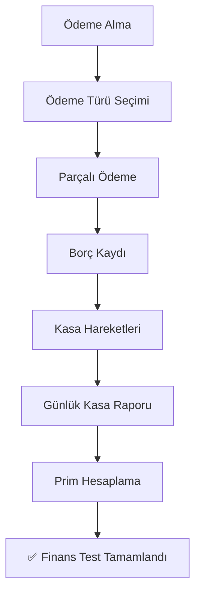
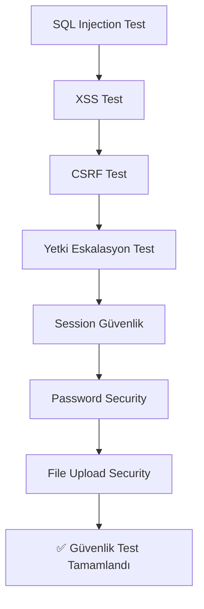
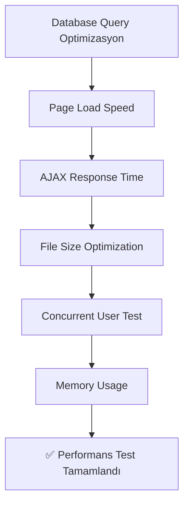
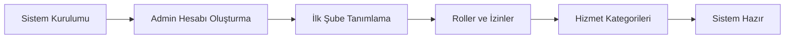
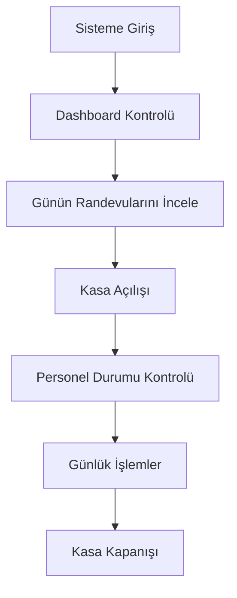
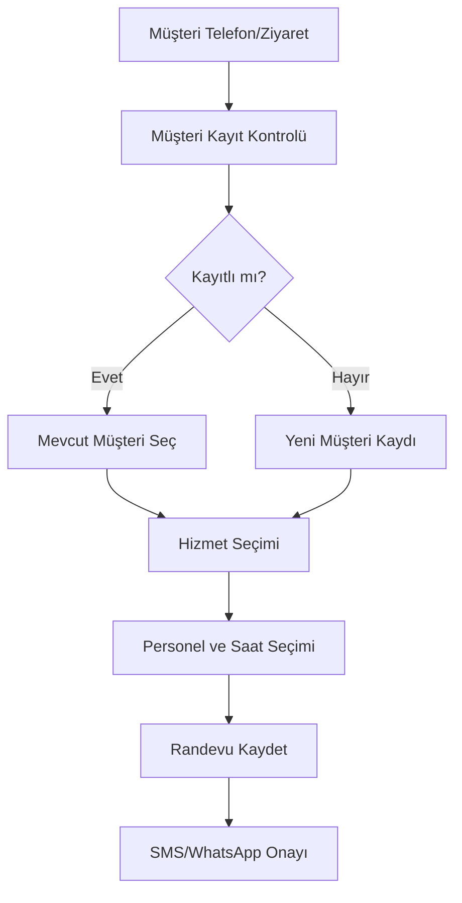
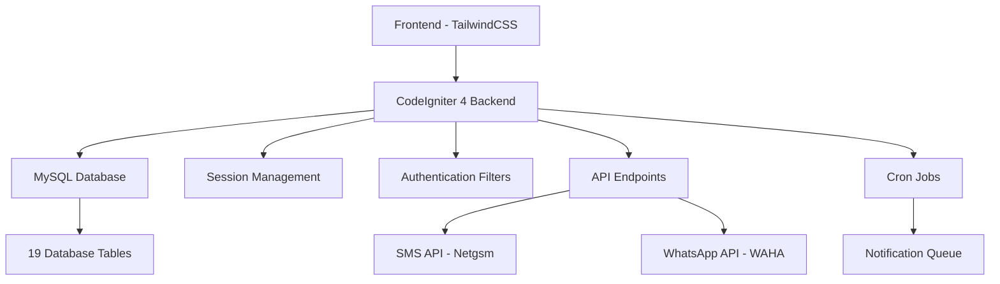

# **GÜZELLİK SALONU RANDEVU SİSTEMİ**
## **KAPSAMLI DOKÜMANTASYON VE TEST PLANI**

---

### **📋 1. PROJE DURUM ÖZETİ**

**✅ Tamamlanan Aşamalar:**
- **Aşama 0:** Hazırlık ve Altyapı (Basamak 1-5) ✅
- **Aşama 1:** Temel Sistem ve Kullanıcı Yönetimi (Basamak 6-9) ✅
- **Aşama 2:** Müşteri ve Hizmet Altyapısı (Basamak 10-12) ✅
- **Aşama 3:** Randevu Yönetimi (Basamak 13-16) ✅
- **Aşama 4:** Finansal İşlemler ve Prim Sistemi (Basamak 17-19) ✅
- **Aşama 5:** Otomasyon ve Ek Özellikler (Basamak 20-22) ✅

**🎯 Kalan Aşama:**
- **Aşama 6:** Son Kontroller ve Yayına Alma (Basamak 23-26)

---

### **📖 2. KULLANICI ROLLERI VE YETKİLER DÖKÜMANTASYONu**

#### **2.1. Admin (Süper Yönetici)**
**Erişim Yetkisi:** Sistem genelindeki tüm özellikler

**Ana Modüller:**
- **🏢 Şube Yönetimi:** Şube CRUD, şube ayarları
- **👥 Kullanıcı Yönetimi:** Tüm roller için kullanıcı CRUD
- **🔐 Rol & İzin Yönetimi:** Sistem yetkileri yönetimi
- **📅 Randevu Yönetimi:** Tüm şubelerin randevuları
- **👤 Müşteri Yönetimi:** Tüm müşteri verileri
- **🛠️ Hizmet & Paket Yönetimi:** Sistem geneli hizmetler
- **💰 Finans Yönetimi:** Tüm şubelerin finansal verileri
- **📊 Raporlama:** Kapsamlı sistem raporları
- **📲 Bildirim Yönetimi:** SMS/WhatsApp ayarları
- **⚙️ Sistem Ayarları:** Tüm konfigürasyon ayarları

#### **2.2. Yönetici (Şube Müdürü)**
**Erişim Yetkisi:** Sadece kendi şubesi

**Ana Modüller:**
- **📅 Randevu Takvimi:** Şube randevu yönetimi
- **👤 Müşteri Yönetimi:** Şube müşteri verileri
- **👥 Personel Yönetimi:** Şube personeli CRUD
- **🛠️ Hizmetler:** Şube hizmet yönetimi
- **📦 Paketler:** Şube paket yönetimi
- **💰 Kasa & Finans:** Şube finansal işlemler
- **📊 Raporlar:** Şube raporları
- **⚙️ Ayarlar:** Sınırlı ayar yetkisi

#### **2.3. Danışma (Resepsiyon)**
**Erişim Yetkisi:** Operasyonel işlemler

**Ana Modüller:**
- **📅 Randevu Yönetimi:** Randevu CRUD işlemleri
- **👤 Müşteri Yönetimi:** Müşteri profil yönetimi
- **🛠️ Hizmetler:** Hizmet listesi görüntüleme
- **📦 Paket Satışı:** Müşteriye paket satışı
- **💳 Ödemeler:** Ödeme alma ve borç yönetimi
- **💰 Kasa İşlemleri:** Günlük kasa açma/kapama
- **⚙️ Ayarlar:** Kişisel ayarlar

#### **2.4. Personel (Uzman/Terapist)**
**Erişim Yetkisi:** Kendi işlemlerine sınırlı

**Ana Modüller:**
- **📅 Randevu Takvimim:** Sadece kendi randevuları (salt okunur)
- **💰 Prim Raporum:** Kendi prim hesapları
- **⚙️ Ayarlar:** Kişisel ayarlar

---

### **🧪 3. KAPSAMLI TEST PLANI**

#### **3.1. Rol Bazlı Yetki Testleri**

##### **Test 1: Admin Rol Yetki Kontrolü**


**Test Adımları:**
1. **Login Test:** `admin@example.com` ile giriş
2. **Dashboard:** Tüm istatistik kartlarının görünümü
3. **Şube Yönetimi:** `/admin/branches` - CRUD işlemleri
4. **Kullanıcı Yönetimi:** `/admin/users` - Tüm roller için CRUD
5. **Randevu Yönetimi:** `/calendar` - Tüm şube randevuları
6. **Müşteri Yönetimi:** `/admin/customers` - Tüm müşteriler
7. **Sistem Ayarları:** `/admin/settings` - Tüm ayarlar
8. **Bildirim Ayarları:** `/notifications/settings` - SMS/WhatsApp

**Beklenen Sonuç:** Tüm menü öğelerine erişim ✅

##### **Test 2: Yönetici Rol Yetki Kontrolü**


**Test Adımları:**
1. **Login Test:** `manager@example.com` ile giriş
2. **Şube Filtresi:** Sadece kendi şubesi verilerini görme
3. **Randevu Yönetimi:** Sadece şube randevuları
4. **Müşteri Filtreleme:** Sadece şube müşterileri
5. **Personel Yönetimi:** Şube personeli CRUD
6. **Admin Panel:** `/admin` - **Erişim Engellenmeli** ❌
7. **Diğer Şube Verileri:** Erişim engellenmeli ❌

**Beklenen Sonuç:** Sadece şube yetkilerinde erişim ✅

##### **Test 3: Danışma Rol Yetki Kontrolü**
**Test Adımları:**
1. **Login Test:** `receptionist@example.com` ile giriş
2. **Randevu CRUD:** Oluşturma, düzenleme, silme
3. **Müşteri CRUD:** Müşteri profil yönetimi
4. **Ödeme İşlemleri:** `/payments` - Ödeme alma
5. **Kasa İşlemleri:** `/cash` - Açma/kapama
6. **Raporlar:** Finansal raporlara **erişim engellenmeli** ❌
7. **Admin İşlemleri:** **Erişim engellenmeli** ❌

##### **Test 4: Personel Rol Yetki Kontrolü**
**Test Adımları:**
1. **Login Test:** `staff@example.com` ile giriş
2. **Randevu Takvimi:** Sadece kendi randevuları (salt okunur)
3. **Prim Raporları:** `/commissions/reports` - Kendi primleri
4. **Müşteri Verilerine Erişim:** **Engellenmeli** ❌
5. **Randevu Oluşturma:** **Engellenmeli** ❌
6. **Finansal Veriler:** **Engellenmeli** ❌

#### **3.2. Fonksiyonel Testler**

##### **Test 5: Randevu Yönetimi Testleri**


**Detaylı Test Senaryoları:**

1. **Randevu Oluşturma Sihirbazı:**
   - Müşteri arama ve yeni müşteri ekleme
   - Hizmet seçimi ve personel filtreleme
   - Müsaitlik kontrolü ve çakışma engelleme
   - Paket kullanımı kontrolü

2. **Takvim İşlevleri:**
   - FullCalendar görünüm testleri (gün/hafta/ay)
   - Sürükle-bırak ile randevu taşıma
   - Resize ile süre değiştirme
   - Durum bazlı renklendirme

3. **Randevu Durumları:**
   - Pending → Confirmed → Completed → Cancelled
   - No-show durumu ve otomatik bildirim
   - Toplu işlemler (Ctrl+Click seçim)

##### **Test 6: Müşteri Yönetimi Testleri**
**Test Senaryoları:**
1. **Müşteri CRUD İşlemleri:**
   - Yeni müşteri ekleme (validation testleri)
   - Müşteri profil düzenleme
   - Müşteri arama ve filtreleme
   - Soft delete (geri getirme)

2. **Müşteri Detay Sekmeleri:**
   - **📅 Randevu Geçmişi:** Filtreleme ve durum görünümü
   - **📦 Paket Kullanımları:** Progress bar ve kalan seans
   - **💳 Ödeme Geçmişi:** Ödeme türü filtreleme
   - **💬 Mesaj Geçmişi:** SMS/WhatsApp kayıtları

3. **Müşteri Etiketleme ve Notlar:**
   - VIP, sorunlu müşteri etiketleri
   - Alerji ve tercih notları

##### **Test 7: Finansal İşlemler Testleri**


**Test Senaryoları:**
1. **Ödeme İşlemleri:**
   - Nakit, kredi kartı, havale/EFT ödemeler
   - Parçalı ödeme (birden fazla tip)
   - Borç kaydı ve takibi
   - İade işlemleri

2. **Kasa Yönetimi:**
   - Günlük kasa açma/kapama
   - Manuel kasa hareketleri (gider/gelir)
   - Kasa raporu hesaplamaları

3. **Prim Sistemi:**
   - Otomatik prim hesaplama (randevu tamamlandığında)
   - Prim kuralları (yüzdesel/sabit tutar)
   - Paket vs normal hizmet prim farkı
   - İade durumunda prim geri alma

##### **Test 8: Paket Yönetimi Testleri**
**Test Senaryoları:**
1. **Paket Tanımlama:**
   - Adet bazlı paketler (10 seans)
   - Dakika bazlı paketler (300 dakika)
   - Geçerlilik süresi kontrolü
   - Paket-hizmet ilişkilendirme

2. **Paket Satışı ve Kullanımı:**
   - Müşteriye paket satışı
   - Randevu sonrası otomatik düşüm
   - Paket bitiş uyarıları
   - Süresi geçen paketlerin iptal edilmesi

##### **Test 9: Bildirim Sistemi Testleri**
**Test Senaryoları:**
1. **SMS/WhatsApp Entegrasyonu:**
   - Netgsm API test mesajı
   - WAHA WhatsApp test mesajı
   - API anahtar doğrulama

2. **Otomatik Tetikleyiciler:**
   - Randevu hatırlatma (24/2 saat öncesi)
   - Paket uyarısı (son seans kaldığında)
   - No-show bildirimi
   - Doğum günü kutlaması

3. **Mesaj Şablonları:**
   - Değişkenli şablon sistemi `{musteri_adi}`, `{randevu_tarihi}`
   - Şablon düzenleme ve önizleme
   - Mesaj kuyruğu ve durumu

#### **3.3. Güvenlik Testleri**

##### **Test 10: Güvenlik Zafiyet Testleri**


**Detaylı Güvenlik Test Senaryoları:**

1. **SQL Injection Testleri:**
   ```sql
   -- Test verileri (form inputlarında)
   ' OR '1'='1
   '; DROP TABLE users; --
   1' UNION SELECT password FROM users--
   ```
   - Tüm form inputları test edilmeli
   - Search boxları özellikle riskli
   - CRUD işlemlerinde parameterized queries kontrolü

2. **XSS (Cross-Site Scripting) Testleri:**
   ```html
   <!-- Test verileri -->
   <script>alert('XSS')</script>
   
   javascript:alert('XSS')
   ```
   - Müşteri notları, etiketler
   - Mesaj şablonları
   - Hizmet/paket açıklamaları

3. **CSRF (Cross-Site Request Forgery) Testleri:**
   - Tüm POST/PUT/DELETE işlemlerde CSRF token kontrolü
   - AJAX isteklerde token doğrulama
   - Critical işlemlerde (silme, ödeme) ek doğrulama

4. **Yetkilendirme Eskalasyon Testleri:**
   - URL manipulation testleri
   - Role bypass denemeleri
   - API endpoint erişim kontrolleri

5. **Session Güvenlik Testleri:**
   - Session timeout kontrolü
   - Paralel login kontrolü
   - Session hijacking koruması

6. **Password Güvenlik Testleri:**
   - Password hashing doğrulama (bcrypt)
   - Password strength requirements
   - Brute force koruması

#### **3.4. Performans Testleri**

##### **Test 11: Performans ve Yük Testleri**


**Test Metrikleri:**
1. **Sayfa Yükleme Süreleri:**
   - Dashboard: < 2 saniye
   - Takvim: < 3 saniye
   - Raporlar: < 5 saniye
   - Müşteri listesi: < 2 saniye

2. **Database Performansı:**
   - Query execution time monitoring
   - N+1 query problemleri
   - Index kullanımı optimizasyonu

3. **Frontend Optimizasyonu:**
   - CSS/JS minification
   - Image optimization
   - CDN kullanımı (gerekirse)

4. **Eşzamanlı Kullanıcı Testi:**
   - 10 kullanıcı eşzamanlı test
   - Takvim çakışma kontrolü yük testi
   - Database lock testleri

#### **3.5. Responsive Tasarım Testleri**

##### **Test 12: Cihaz Uyumluluk Testleri**
**Test Cihazları:**
1. **Desktop (1920x1080):**
   - Chrome, Firefox, Safari, Edge
   - Takvim tam genişlik görünümü
   - Sidebar açık/kapalı durumlar

2. **Tablet (768x1024):**
   - iPad, Android tablet
   - Responsive sidebar (collapsible)
   - Touch-friendly butonlar

3. **Mobile (375x667):**
   - iPhone, Android phone
   - Mobile dropdown menü
   - Touch gestures (swipe, tap)

**Test Edilen Özellikler:**
- Menü responsivitesi
- Form görünümleri
- Tablo responsive'ı
- Modal popup'lar
- Takvim görünümü

#### **3.6. Browser Uyumluluk Testleri**

##### **Test 13: Cross-Browser Testleri**
**Desteklenen Tarayıcılar:**
- **Chrome:** v90+ ✅
- **Firefox:** v88+ ✅
- **Safari:** v14+ ✅
- **Edge:** v90+ ✅
- **Internet Explorer:** DESTEKLENMEZ ❌

**Test Edilen Özellikler:**
- TailwindCSS class uyumluluğu
- JavaScript compatibility
- AJAX request'ler
- File upload işlevleri
- Print styling

---

### **📚 4. KULLANICI KILAVUZLARI**

#### **4.1. Admin Kullanıcı Kılavuzu**

##### **4.1.1. İlk Kurulum ve Giriş**


**Adım 1: Giriş ve Dashboard**
1. Tarayıcıda `http://randevu.host:8080` adresini açın
2. Admin bilgileri ile giriş yapın:
   - Email: `admin@example.com`
   - Şifre: [admin şifresi]
3. Dashboard'da sistem geneli istatistikleri görüntüleyin

**Adım 2: Şube Yönetimi**
1. **Admin Panel > Şube Yönetimi** menüsüne gidin
2. **"Yeni Şube Ekle"** butonuna tıklayın
3. Şube bilgilerini doldurun:
   - Şube Adı: Merkez Şube
   - Adres: Tam adres bilgisi
   - Telefon: Şube telefon numarası
   - Email: Şube email adresi
4. **"Kaydet"** butonuna tıklayın

**Adım 3: Kullanıcı ve Personel Ekleme**
1. **Admin Panel > Kullanıcı Yönetimi** menüsüne gidin
2. **"Yeni Kullanıcı Ekle"** butonuna tıklayın
3. Kullanıcı bilgilerini doldurun:
   - Ad, Soyad, Email, Telefon
   - Şube seçimi
   - Rol seçimi (Yönetici/Danışma/Personel)
   - Çalışma saatleri (Personel için)
   - Prim oranı (Personel için)

##### **4.1.2. Hizmet ve Paket Yönetimi**
**Hizmet Kategorisi Ekleme:**
1. **Admin Panel > Hizmet Yönetimi > Kategoriler** menüsüne gidin
2. Kategori ekleyin: "Cilt Bakımı", "Lazer Epilasyon", "Masaj" vb.

**Hizmet Ekleme:**
1. **Admin Panel > Hizmet Yönetimi > Hizmetler** menüsüne gidin
2. Hizmet bilgilerini doldurun:
   - Hizmet Adı: "Cilt Temizliği"
   - Kategori: "Cilt Bakımı"
   - Süre: 60 dakika
   - Fiyat: 150 TL
   - Hangi personeller verebilir: Seçim yapın

**Paket Oluşturma:**
1. **Admin Panel > Paket Yönetimi** menüsüne gidin
2. Paket türünü seçin (Adet/Dakika bazlı)
3. Paket detaylarını doldurun
4. Geçerlik süresi belirleyin
5. Hangi hizmetlerde kullanılabileceğini seçin

##### **4.1.3. Bildirim Sistemi Kurulumu**
**SMS Ayarları (Netgsm):**
1. **Admin Panel > Bildirim Yönetimi > Ayarlar** menüsüne gidin
2. SMS Provider olarak "Netgsm" seçin
3. API bilgilerini girin:
   - Kullanıcı Adı: [netgsm kullanıcı adı]
   - Şifre: [netgsm şifre]
   - Başlık: [SMS başlığı]
4. **"Test Mesajı Gönder"** ile test edin

**WhatsApp Ayarları (WAHA):**
1. WAHA Provider bilgilerini girin:
   - API URL: [WAHA endpoint]
   - API Key: [WAHA token]
2. Test mesajı gönderin

**Mesaj Şablonları:**
1. **Bildirim Yönetimi > Şablonlar** menüsüne gidin
2. Öntanımlı şablonları düzenleyin
3. Değişkenleri kullanın: `{musteri_adi}`, `{randevu_tarihi}`, `{salon_adi}`

##### **4.1.4. Prim Kuralları ve Finansal Ayarlar**
**Prim Kuralları Tanımlama:**
1. **Admin Panel > Prim Yönetimi > Kurallar** menüsüne gidin
2. Her hizmet için prim oranı belirleyin:
   - Cilt Bakımı: %15
   - Lazer Epilasyon: %10
   - Masaj: %20
3. Normal vs Paket hizmet prim farkını belirleyin

#### **4.2. Yönetici Kullanıcı Kılavuzu**

##### **4.2.1. Günlük İşlem Akışı**


**Sabah Rutini:**
1. Sisteme giriş yapın
2. Dashboard'da günlük istatistikleri kontrol edin
3. **Kasa & Finans > Kasa Yönetimi** menüsünden günlük kasa açılışı yapın
4. Açılış tutarını girin ve kasayı açın
5. **Randevu Takvimi** ile günün randevularını inceleyin

**Gün İçi İşlemler:**
1. Yeni randevu talepleri için **Randevu Yönetimi** kullanın
2. Müşteri ödemelerini **Ödemeler** menüsünden takip edin
3. Personel durumunu takvim üzerinden kontrol edin

**Akşam Rutini:**
1. Günlük randevuların tamamlanıp tamamlanmadığını kontrol edin
2. **Kasa & Finans > Kasa Kapanışı** ile günlük kasayı kapatın
3. **Raporlar > Günlük Rapor** ile günlük özeti alın

##### **4.2.2. Personel Yönetimi**
**Yeni Personel Ekleme:**
1. **Personel Yönetimi > Yeni Personel** menüsüne gidin
2. Personel bilgilerini doldurun
3. Çalışma saatlerini ayarlayın
4. Prim oranını belirleyin
5. Hangi hizmetleri verebileceğini seçin

**Personel Performans Takibi:**
1. **Raporlar > Personel Raporu** menüsüne gidin
2. Aylık/haftalık randevu sayıları
3. Müşteri memnuniyet yorumları
4. Prim kazançları

#### **4.3. Danışma (Resepsiyon) Kullanıcı Kılavuzu**

##### **4.3.1. Randevu Alma İşlemleri**


**Telefonla Randevu Alma:**
1. **Randevu Yönetimi > Yeni Randevu** butonuna tıklayın
2. Müşteri adı/telefon ile arama yapın
3. Bulamazsanız **"Yeni Müşteri Ekle"** butonunu kullanın
4. Hizmet seçin (müşterinin paketi varsa otomatik gösterilir)
5. Uygun personel ve saati seçin
6. Randevuyu kaydedin
7. Otomatik SMS/WhatsApp gönderimini onaylayın

**Paket Satışı:**
1. **Müşteri Profili > Paket Sat** butonuna tıklayın
2. Uygun paketi seçin
3. Ödeme alma ekranından paket ücretini tahsil edin
4. Müşteriye paket detaylarını açıklayın

##### **4.3.2. Ödeme İşlemleri**
**Randevu Sonrası Ödeme Alma:**
1. Randevuyu **"Tamamlandı"** olarak işaretleyin
2. Açılan ödeme ekranında ücret görünür
3. Ödeme türünü seçin (Nakit/Kart/Havale)
4. Parçalı ödeme gerekirse **"Ödeme Ekle"** butonunu kullanın
5. Eksik tutar varsa otomatik borç kaydı oluşur

**Borç Takibi:**
1. **Ödemeler > Borçlu Müşteriler** menüsüne gidin
2. Borçlu müşterileri listeleyin
3. Borç ödeme girişi yapın

##### **4.3.3. Kasa İşlemleri**
**Günlük Kasa Açma:**
1. **Kasa & Finans > Kasa Aç** menüsüne gidin
2. Kasadaki mevcut tutarı sayın ve girin
3. **"Kasayı Aç"** butonuna tıklayın

**Günlük Kasa Kapama:**
1. **Kasa & Finans > Kasa Kapat** menüsüne gidin
2. Kasadaki tutarı sayın
3. Sistem ile karşılaştırın
4. Farklı varsa açıklama girin
5. **"Kasayı Kapat"** butonuna tıklayın

#### **4.4. Personel Kullanıcı Kılavuzu**

##### **4.4.1. Günlük Takvim Kontrolü**
**Randevu Takvimi Görüntüleme:**
1. Sisteme giriş yapın
2. **Randevu Takvimim** menüsüne gidin
3. Günlük/haftalık görünümde randevularınızı görün
4. Randevu detaylarına tıklayarak müşteri notlarını okuyun

**Randevu Notları:**
1. Tamamlanan randevulara not ekleyin
2. Müşteri tercihlerini kaydedin
3. Bir sonraki seansta dikkat edilmesi gerekenleri yazın

##### **4.4.2. Prim Raporu Takibi**
**Aylık Prim Kontrolü:**
1. **Prim Raporum** menüsüne gidin
2. Tarih aralığı seçin (Bu ay/Geçen ay)
3. Detaylı prim raporunu görüntüleyin:
   - Hizmet bazlı prim dağılımı
   - Günlük kazanç trendi
   - Toplam aylık prim

---

### **🔧 5. TEKNİK DOKÜMANTASYON**

#### **5.1. Sistem Mimarisi**


#### **5.2. Database Schema**
**Ana Tablolar:**
- `branches` - Şube bilgileri
- `users` - Kullanıcı hesapları  
- `roles`, `permissions` - Yetkilendirme
- `customers` - Müşteri bilgileri
- `services`, `service_categories` - Hizmet tanımları
- `packages` - Paket tanımları
- `appointments` - Randevu kayıtları
- `payments` - Ödeme işlemleri
- `cash_movements` - Kasa hareketleri
- `commissions` - Prim hesaplamaları
- `notifications` - Bildirim sistemi

#### **5.3. API Endpoints**
**Authentication:**
- `POST /auth/login` - Giriş
- `POST /auth/logout` - Çıkış

**Calendar API:**
- `GET /calendar/events` - Takvim eventleri
- `POST /calendar/create` - Randevu oluştur
- `PUT /calendar/update/{id}` - Randevu güncelle
- `DELETE /calendar/delete/{id}` - Randevu sil

**Notification API:**
- `POST /notifications/send-sms` - SMS gönder
- `POST /notifications/send-whatsapp` - WhatsApp gönder

#### **5.4. Güvenlik Katmanları**
1. **Authentication Filter** (`AuthFilter.php`)
2. **Admin Filter** (`AdminFilter.php`)
3. **CSRF Protection** (CodeIgniter built-in)
4. **SQL Injection Protection** (Query Builder)
5. **XSS Protection** (Input filtering)
6. **Password Hashing** (PHP password_hash)

#### **5.5. Deployment Gereksinimleri**
**Sunucu Gereksinimleri:**
- PHP 8.0+
- MySQL 8.0+
- Apache/Nginx
- SSL Certificate (HTTPS)
- Cron Job desteği

**Gerekli PHP Extensions:**
```php
- php-json
- php-mysqlnd
- php-curl
- php-openssl
- php-mbstring
- php-xml
```

---

### **⚡ 6. PERFORMANS OPTİMİZASYON REHBERİ**

#### **6.1. Database Optimizasyonu**
**Index Stratejisi:**
```sql
-- Kritik indexler
CREATE INDEX idx_appointments_staff_date ON appointments(staff_id, appointment_date);
CREATE INDEX idx_customers_phone ON customers(phone);
CREATE INDEX idx_payments_date ON payments(payment_date);
CREATE INDEX idx_branch_filter ON appointments(branch_id, appointment_date);
```

**Query Optimizasyonu:**
```php
// N+1 Query problemi önleme
$appointments = $appointmentModel
    ->select('appointments.*, customers.first_name, customers.last_name, 
              services.name as service_name, users.first_name as staff_name')
    ->join('customers', 'customers.id = appointments.customer_id')
    ->join('services', 'services.id = appointments.service_id')
    ->join('users', 'users.id = appointments.staff_id')
    ->where('appointments.branch_id', $branchId)
    ->findAll();
```

#### **6.2. Frontend Optimizasyonu**
**CSS/JS Minification:**
```bash
# Production build
npm run build-css-prod
```

**Asset Optimization:**
- Image compression (WebP format)
- CSS/JS concatenation
- Browser caching headers
- CDN kullanımı (opsiyonel)

#### **6.3. Memory Usage**
**CodeIgniter Optimizasyonu:**
```php
// Config/App.php
public $memoryLimit = '256M';
public $maxExecutionTime = 60;

// Database connection pooling
public $DBDebug = false; // Production'da
```

---

### **🚀 7. DEPLOYMENT REHBERİ**

#### **7.1. Production Environment Setup**
```bash
# 1. Sunucu hazırlığı
sudo apt update
sudo apt install apache2 php8.0 mysql-server php8.0-mysql php8.0-curl

# 2. Proje yükleme
git clone [repository-url] /var/www/randevu
cd /var/www/randevu

# 3. Composer dependencies
composer install --no-dev --optimize-autoloader

# 4. Node.js dependencies ve CSS build
npm install
npm run build-css-prod

# 5. Environment configuration
cp env .env
# .env dosyasını production ayarlarıyla düzenle

# 6. Database migration
php spark migrate
php spark db:seed DefaultDataSeeder

# 7. Permissions
sudo chown -R www-data:www-data /var/www/randevu
sudo chmod -R 755 /var/www/randevu
sudo chmod -R 777 /var/www/randevu/writable
```

#### **7.2. Production .env Configuration**
```env
CI_ENVIRONMENT = production

database.default.hostname = [production-db-host]
database.default.database = [production-db-name]
database.default.username = [production-db-user]
database.default.password = [production-db-password]

# Security
encryption.key = [32-character-random-key]
app.sessionDriver = 'CodeIgniter\Session\Handlers\DatabaseHandler'

# SMS/WhatsApp
netgsm.username = [production-netgsm-username]
netgsm.password = [production-netgsm-password]
waha.endpoint = [production-waha-endpoint]
waha.token = [production-waha-token]
```

#### **7.3. Cron Job Setup**
```bash
# Crontab düzenleme
crontab -e

# Otomatik bildirim işleme (her 5 dakikada)
*/5 * * * * cd /var/www/randevu && php spark queue:process

# Günlük paket süresi kontrolü (her gece 02:00)
0 2 * * * cd /var/www/randevu && php spark packages:expire-old

# Doğum günü mesajları (her sabah 09:00)
0 9 * * * cd /var/www/randevu && php spark notifications:birthday
```

#### **7.4. SSL ve Apache Configuration**
```apache
<VirtualHost *:443>
    ServerName randevu.yourdomain.com
    DocumentRoot /var/www/randevu/public
    
    SSLEngine on
    SSLCertificateFile /path/to/certificate.crt
    SSLCertificateKeyFile /path/to/private.key
    
    <Directory /var/www/randevu/public>
        AllowOverride All
        Require all granted
    </Directory>
    
    # Security headers
    Header always set X-Frame-Options DENY
    Header always set X-Content-Type-Options nosniff
    Header always set X-XSS-Protection "1; mode=block"
</VirtualHost>
```

---

### **✅ 8. SON KONTROLLLER CHECK-LİSTİ**

#### **8.1. Basamak 23: Kapsamlı Test ve Hata Ayıklama**
- [ ] **Admin rol yetki testi** - Tüm özellikler erişilebilir
- [ ] **Yönetici rol yetki testi** - Şube sınırlaması çalışıyor
- [ ] **Danışma rol yetki testi** - Operasyonel yetkiler doğru
- [ ] **Personel rol yetki testi** - Sınırlı erişim çalışıyor
- [ ] **Randevu CRUD testi** - Tüm işlemler hatasız
- [ ] **Takvim işlevleri testi** - Sürükle-bırak, resize çalışıyor
- [ ] **Ödeme işlemleri testi** - Tüm ödeme türleri çalışıyor
- [ ] **Paket sistemi testi** - Otomatik düşüm çalışıyor
- [ ] **Bildirim sistemi testi** - SMS/WhatsApp gönderimi çalışıyor
- [ ] **Prim hesaplama testi** - Otomatik hesaplama doğru
- [ ] **Responsive tasarım testi** - Mobile/tablet/desktop
- [ ] **Browser uyumluluk testi** - Chrome/Firefox/Safari/Edge

#### **8.2. Basamak 24: Güvenlik Denetimi ve Optimizasyon**
- [ ] **SQL Injection testi** - Tüm formlar güvenli
- [ ] **XSS koruması testi** - Input filtering çalışıyor
- [ ] **CSRF koruması testi** - Token doğrulama aktif
- [ ] **Yetki eskalasyon testi** - Role bypass engellendi
- [ ] **Session güvenlik testi** - Timeout ve hijacking koruması
- [ ] **Password güvenlik testi** - Hashing ve strength doğru
- [ ] **Database optimizasyon** - Index'ler ve query optimizasyonu
- [ ] **Frontend optimizasyon** - CSS/JS minification
- [ ] **Performance testleri** - Sayfa yükleme süreleri kabul edilebilir
- [ ] **Memory usage testi** - Resource kullanımı optimum

#### **8.3. Basamak 25: Dokümantasyon Hazırlığı**
- [x] **Admin kullanıcı kılavuzu** - Tamamlandı ✅
- [x] **Yönetici kullanıcı kılavuzu** - Tamamlandı ✅
- [x] **Danışma kullanıcı kılavuzu** - Tamamlandı ✅
- [x] **Personel kullanıcı kılavuzu** - Tamamlandı ✅
- [x] **Teknik dokümantasyon** - Tamamlandı ✅
- [x] **API dokümantasyonu** - Endpoint listesi hazır
- [x] **Database schema dokümantasyonu** - ER diagram güncel
- [x] **Deployment rehberi** - Adım adım kılavuz hazır

#### **8.4. Basamak 26: Yayına Alma (Deployment)**
- [ ] **Production sunucu hazırlığı** - PHP/MySQL/Apache kurulumu
- [ ] **SSL sertifikası** - HTTPS yapılandırması
- [ ] **Domain yapılandırması** - DNS ayarları
- [ ] **.env production ayarları** - Güvenlik anahtarları
- [ ] **Database migration** - Production DB kurulumu
- [ ] **Default data seeding** - Test verilerinin temizlenmesi
- [ ] **Cron job kurulumu** - Otomatik görevler tanımlandı
- [ ] **Backup sistemi** - Otomatik yedekleme kuruldu
- [ ] **Monitoring kurulumu** - Error logging aktif
- [ ] **Son kullanıcı testi** - Production'da final test
- [ ] **Go-live onayı** - Müşteri kabul testi

---

**🎯 SONUÇ:**
Bu dokümantasyon, Güzellik Salonu Randevu ve Yönetim Sistemi'nin tüm modülleri, test senaryoları ve kullanıcı kılavuzlarını kapsamlı olarak içermektedir. Sistem Aşama 6'ya geçmeye hazır durumda olup, bu dokümanda belirtilen test adımları takip edilerek güvenli bir şekilde canlıya alınabilir.

**Son Güncelleme:** 13.06.2025 - 21:04